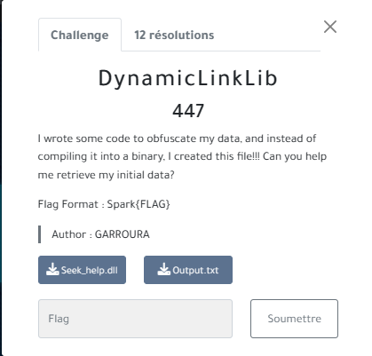
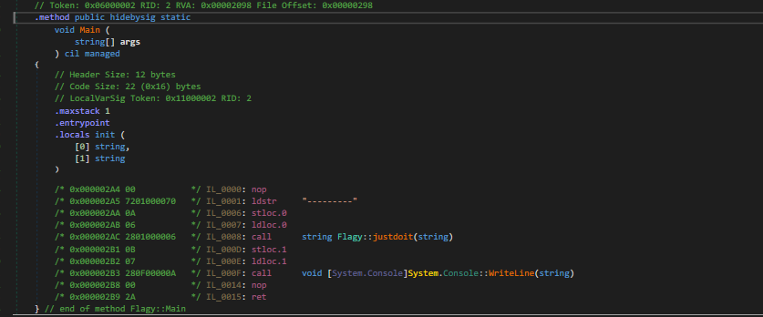
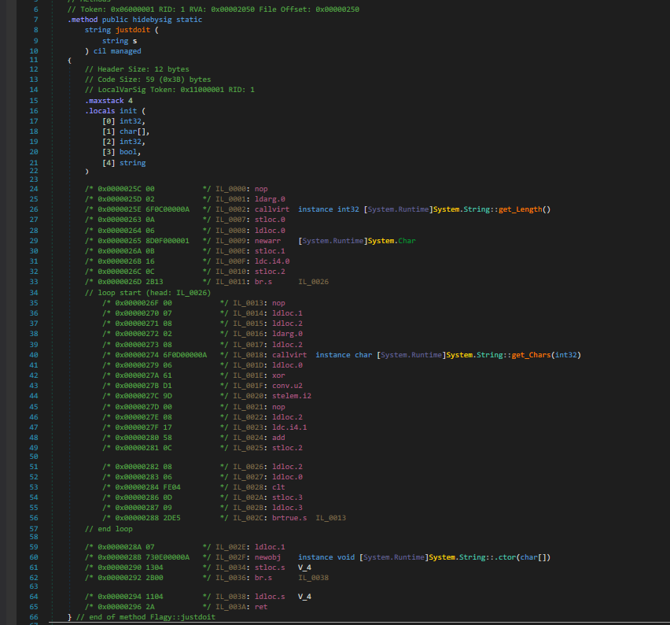
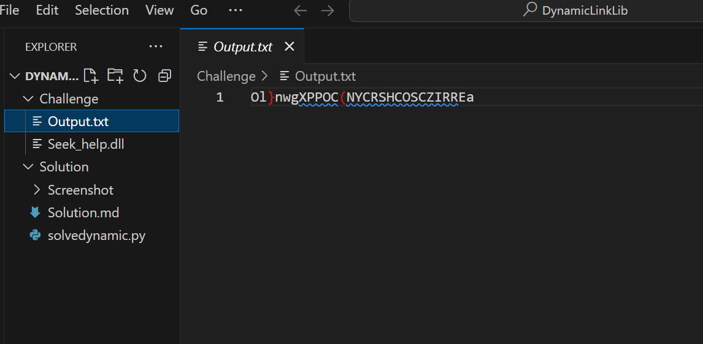
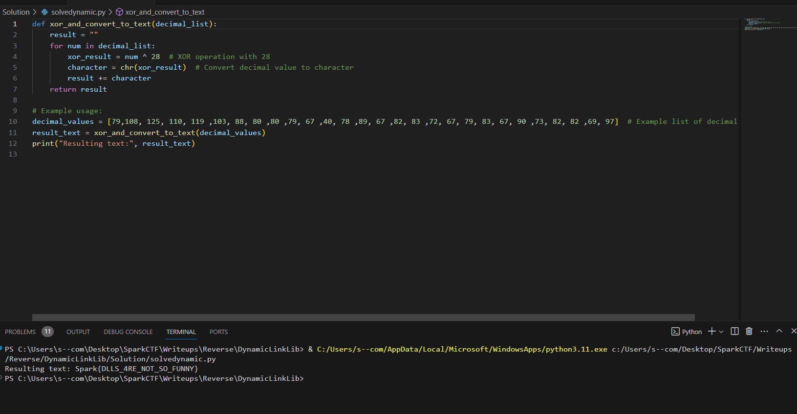

#S4L1M --> #F4K3_RooT PLAYER

## DynamicLinkLib  	

### Infos About challenge : 

### They are 12 Teams solved this challenge from 100 Teams

### Description : 

##### I wrote some code to obfuscate my data, and instead of compiling it into a binary, I created this file!!! Can you help me retrieve my initial data?

## solution:

### step 1 : Open The Seek_help.dll  in Dnspy 

##### It is tool to read and decompile .dll file 

##### You notice that the Seek_help.dll has a function Flagy.main

###### when we click on it we will have the assembly code of Flagy.dll 

###### You can notice that we have main function that scan input (string)  

###### and  this main function called another function called justdoit and passe to it the input (string), so click on it to be redirected to the assembly code of this function 

### Step 2 : Analyze the assembly of just do it 

###### After analyzing and some ChatGPT assistance You can understand that this function does this :  

   ##### 1-It loads the length of the input string that is passed from the main function onto the stack
   ##### 2-It performs a bitwise XOR operation (xor) between the each character of the input and the length of the input string
   ##### 3-Finally it write the result in file named output.txt .
  
   
##### now open the output.txt that it giving to you in the challenge and you notice that have 24 characters  

### Step 3 : Now time of scripting XD : 
#### We Have this data in our Hand : 
##### 1- Length of our input and output is 28
##### 2- the output after doing XORing the Input with 28 is "Ol}nwgXPPOC(NYCRSHCOSCZIRREa"
##### 3- we should convert each caracter to ASCII code 

###### our script should : 
###### 1- initialise a list that have ascii code of our output 
###### 2-make the same Xor operation beetween each caracter and 24 , because reverse of XOR operation is the same XOR operation
###### 3-store the result in a list called decimal value 
###### 4-AND Finally  convert the list of ascii to String and this is the flag 

###### and this is the Script : 

### Step 04  : Run The script And check the content of Terminal  

### Flag:

### Spark{DLLS_4RE_NOT_SO_FUNNY}
